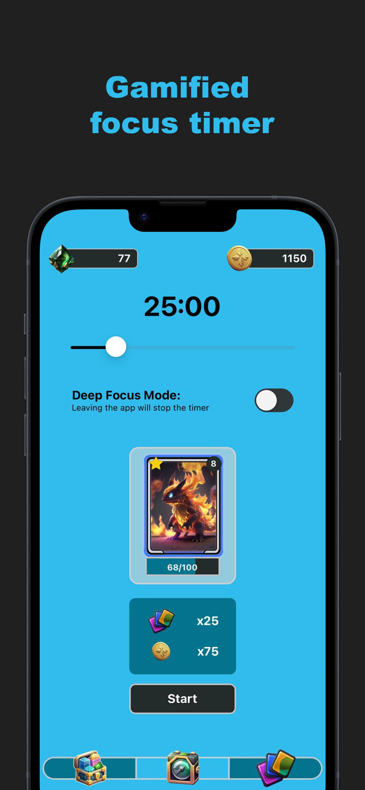
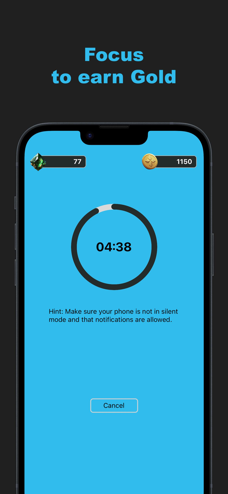
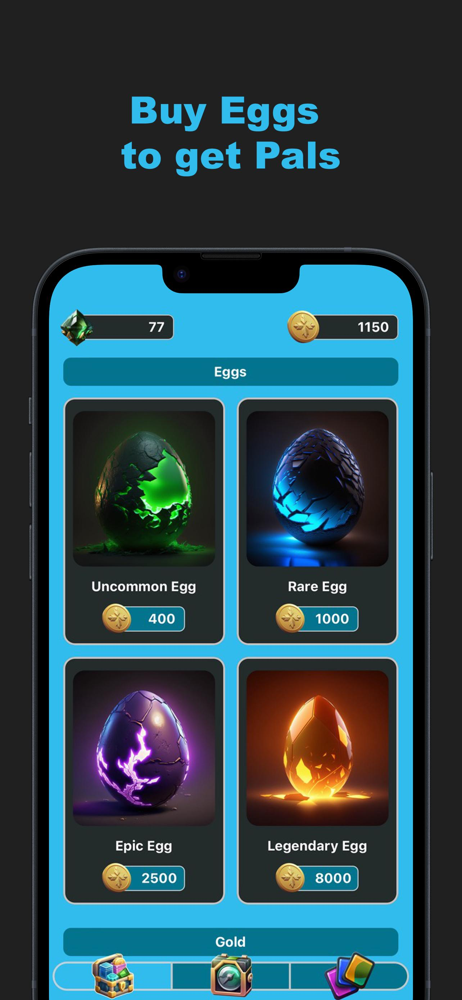
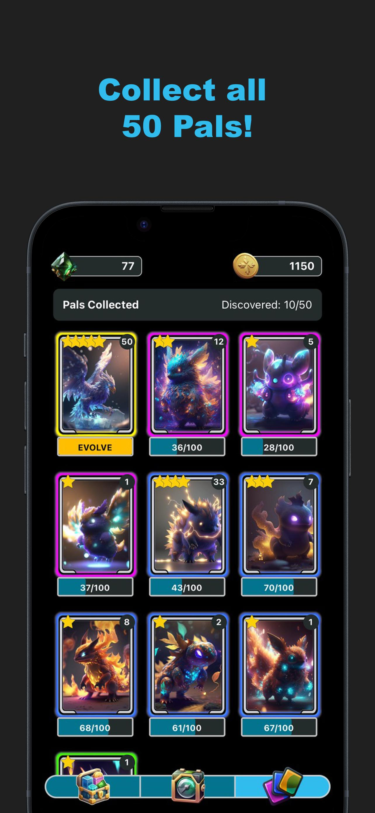
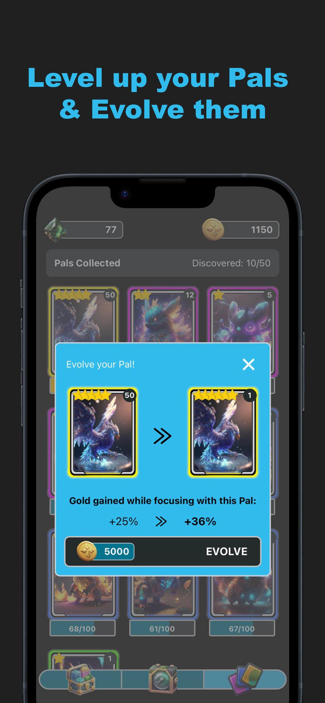

# Focus Pals

## ⚠️ Important Notice
> **❌ Not on the App Store anymore as of March 2025.**  
> I decided not to renew the Apple Developer Program membership since it costs **160 AUD/year**.

## App Previews

  
  
  
  
  

## Project Overview
**Focus Pals** is a gamified focus and study companion app designed to enhance productivity, self-control, and concentration. Built with **React Native/JavaScript**, the app uses **Firebase** for its backend.  

Focus Pals was available on the **App Store** and received positive feedback, with **five 5-star reviews** and **195 organic downloads**.

## Features
- **🎯 Gamified Focus Timer** – Stay focused, earn gold, and collect virtual pets called *Pals*.
- **🐾 Choose Your Companion** – Select a *Pal* to accompany you during study sessions. *Pals* gain XP as you focus.
- **⚡ Level Up and Evolve** – Level up your *Pals* and evolve them to unlock bonus gold rewards.
- **🔎 50 Unique Pals** – Discover and collect a diverse range of virtual companions, from common to legendary.
- **🚀 Deep Focus Mode** – Enable *Deep Focus Mode* to ensure uninterrupted study sessions. Leaving the app results in losing Gold and XP rewards.

## Technologies Used
- **⚛️ React Native** – Framework for building cross-platform mobile applications.
- **📜 JavaScript** – Programming language used for app functionality.
- **🔥 Firebase** – Backend services for authentication, database, and storage.

## App Store Performance
- **⭐ Reviews:** 5 five-star reviews.
- **📥 Downloads:** 195 downloads from organic traffic.

~~## Published on the App Store~~  
~~[Download Focus Pals on the App Store](https://apps.apple.com/us/app/focus-pals/id6478242535)~~ *(No longer available as of March 2025)*
